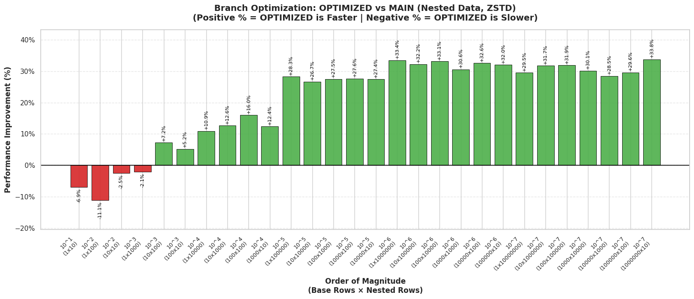

A primary objective of my Google Summer of Code (GSoC) project is to parallelize the reading of struct types in Parquet files. This enhancement is highly beneficial to the broader scientific community, as astronomical datasets frequently rely on structs and other nested data structures.

Recent benchmarking highlights the performance differences between the optimized Parquet reader I have developed and the baseline implementation in the `apache/arrow` main branch. These benchmarks were executed on a standard free GitHub runner, with the data pre-loaded into RAM to eliminate irrelevant I/O overhead.

While the overhead associated with multi-threading results in slightly slower execution for smaller files, the optimized reader demonstrates a significant performance improvement of 25% to 30%+ when processing large, real-world datasets.

Furthermore, when multi-threading is enabled, reading nested structs now achieves speeds comparable to those of flat Parquet files.

Overall, the project is progressing at an excellent pace and yielding verifiable results. I look forward to integrating these changes into the upstream Apache Arrow library, providing a substantial performance boost for researchers and practitioners working with PyArrow on complex astronomical datasets.

### Relevant Links

* **Pull Request:** [apache/arrow#50158](https://github.com/apache/arrow/pull/50158)
* **Results Colab Notebook:** [View Benchmarks](https://colab.research.google.com/drive/1TsxFkBSI_Iq0hfXEwNDs_D24acr3yxdC?usp=sharing)
* **Benchmarking Repository:** [OmBiradar/pyarrow-lincc-fw-openastronomy-gsoc26](https://github.com/OmBiradar/pyarrow-lincc-fw-openastronomy-gsoc26)
